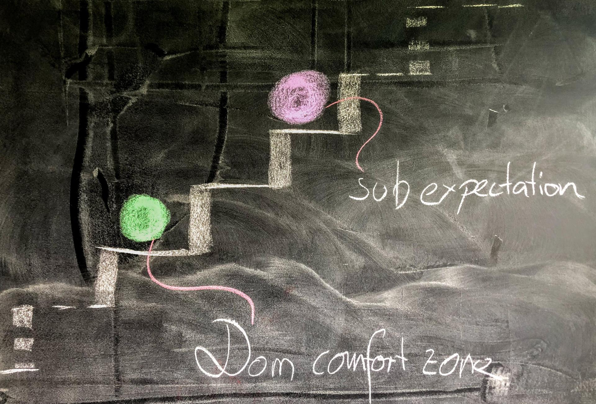
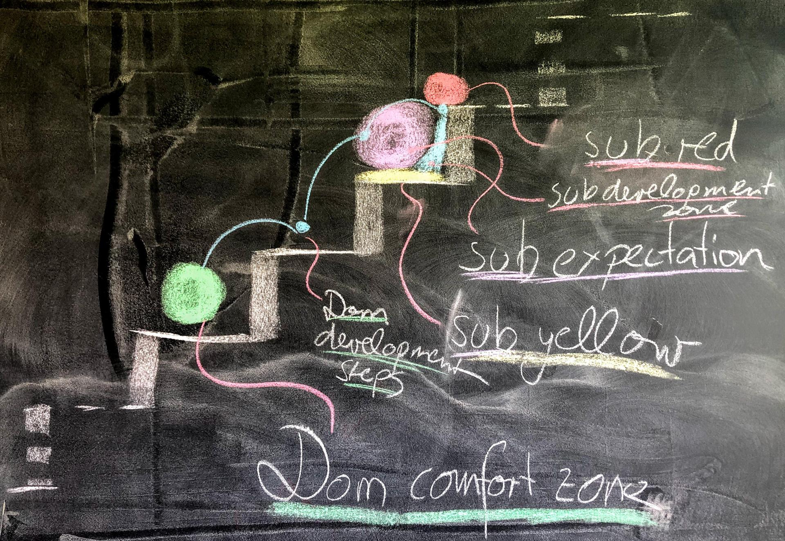

# Up Your Domination Game


I'm publishing this article here on my coaching website as I'm convinced that practices and values present in the BDSM community can help a leader in this modern world grasp fundamental knowledge about humans and leadership and gain valuable insights into behaviour and dynamics, even if they don't know much about BDSM or don't want to practice it themselves.


As a **Dominant** in your D/s type of play, you already put a huge amount of **care and consideration** into creating a [**safe, sane and consensual**](https://en.wikipedia.org/wiki/Safe,_sane_and_consensual) scene for your submissive with the intent to **lead to deeper pleasure** and explore boundaries and push them ever so slightly for growth. The growth of both Dominant and submissive. There is a perceived discomfort in going further and this is the exploration and negotiation between the two that leads to more depth.

## Seek discomfort

You lead your submissive and they want you to take them "two steps" further than you feel comfortable.

The exercise and art form now becomes to seek discomfort for growth and pleasure using full force of "dom confidence" and lead into the unknown white spots on your map and plant your flag there. A land to be discovered together while drawing the map. The submissive needs to surrender and trust and listen to their body. From personal experience and conversation I know that the element of trust needs to propagate from heart to mind to body.

So even if your submissive's decision and feeling of trust is present, the body/limbic brain needs more time to adjust and neural pathways need to extend to control the fight/flight/freeze response ensuring instinctive survival. It's an intricate process of reprogramming to translate the experience of being controlled and pain (on the submissive's side) into a physical mode of safety and pleasure provided by the Dominant. It's also a fundamental dynamic that is being played with here. The triggering of the fight/flight/freeze response is responsible for the adrenaline rush. Arriving at safety gives you endorphins. Thus deep bonding occurs.

## Growth opportunities

In the scheme of the [basic safe word levels](https://boldpleasures.com/kinky-life/getting-started/safeword-basics/) green, yellow, red, it's OK to go to red with your submissive. In my thinking this colour red was something that I tried to avoid at all costs in fear of breaking something.

If you imagine your Domination comfort zone as a staircase, your red and your submissive's red are both very close to the start of the staircase to begin with. For those new to the BDSM practice and also for those well experienced, red is an ever moving target and different in any D/s play relationships, and can progress a step up with every scene played. In my experience, the Dominant's green edging on yellow is their comfort zone and your submissive's yellow didn't even start, yet.

So in order to play a scene that provides a satisfying experience for your submissive, you need to suss out and operate in your submissive's yellow zone, which might be in your red. With the Dominant's red being the aformentioned fear of breaking something. Of course all of this is an ongoing dialogue as I'm sure you appreciate that BDSM in general requires a very communicative environment to be sane. What popular culture displays as BDSM is at times far from [**safe, sane and consensual**](https://en.wikipedia.org/wiki/Safe,_sane_and_consensual).

